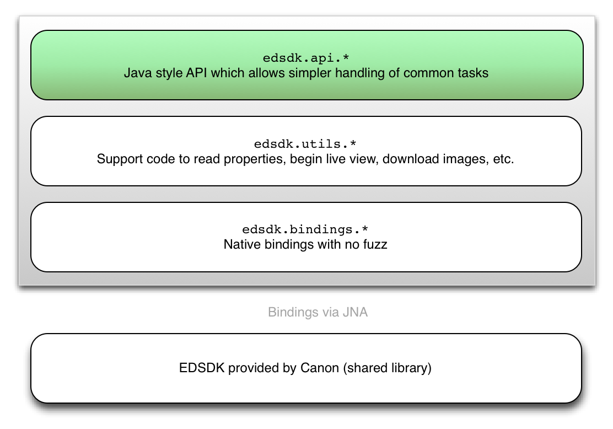

EDSDK4J
=======

## Purpose
This is a Java wrapper around the Canon EOS Digital Software Development Kit EDSDK that gives you full access to your Canon SLR camera on Windows*. The features include: 

- Taking and downloading pictures
- Manually adjusting focus
- Setting apperature, exposure, ISO
- Accessing live view

(*) With a few changes it might also work on Mac OSX. 

## Project
* Open Source hosted at https://github.com/kritzikratzi/edsdk4j
* License based on license of libraries used - the rest is WTFPL http://www.wtfpl.net/
* Maven based Java project including JUnit 4 tests.

## Documentation/Issues
* [Wiki](https://github.com/kritzikratzi/edsdk4j/wiki)
* [Issues](https://github.com/kritzikratzi/edsdk4j/issues)

### Distribution
Available at Maven Central see 

http://search.maven.org/#artifactdetails|edsdk4j|edsdk4j|0.0.1|jar

Maven dependency:

```xml
<dependency>
  <groupId>edsdk4j</groupId>
  <artifactId>edsdk4j</artifactId>
  <version>0.0.1</version>
</dependency>
```

### How to build
You might want to make sure that you have your ESDK in place - see "Applying with Canon for ESDK ..." below
```
git clone https://github.com/kritzikratzi/edsdk4j
cd edsdk4j
mvn install -Dgpg.skip=true
```

### Testing
Before running the Unit Tests you might want to connect your camera with an USB cable and make sure that no 
other application is using the USB connection to your camera.

If you have a maven command line installed you can run the tests from the command line with:
```
mvn test
```

or run the tests in you IDE. E.g. in Eclipse click pom.xml and choose "Run As/Maven test".

#### expected mvn test result

```
-------------------------------------------------------
 T E S T S
-------------------------------------------------------
Running edsdk.TestCanonConstants
Begin checking whether CanonConstants has all constants from EdSdkLibrary
Completed checking
Tests run: 1, Failures: 0, Errors: 0, Skipped: 0, Time elapsed: 0.382 sec
Running edsdk.TestEDSDK
Camera saved an image file
Saved photo as: C:\Users\wf\AppData\Local\Temp\IMG_0001.JPG
EdsImageQuality_LJF/1310479
EdsImageQuality_LJN/1244943
EdsImageQuality_MJF/18087695
EdsImageQuality_MJN/18022159
EdsImageQuality_SJF/34864911
EdsImageQuality_SJN/34799375
EdsImageQuality_LRLJF/6553619
EdsImageQuality_LR/6618895
Canon Camera: Canon EOS 1000D is connected

Interrupt received in CanonCamera, stopping...
EDSDK Dispatcher thread says bye!
Tests run: 4, Failures: 0, Errors: 0, Skipped: 0, Time elapsed: 9.958 sec
Running edsdk.TestJNA
Tests run: 2, Failures: 0, Errors: 0, Skipped: 0, Time elapsed: 0 sec
Running edsdk.TestLibrary
Versions:
ProductVersion   FileVersion      FileName                                     
--------------   -----------      --------                                     
3.4.20.6404      3.4.20.6404      C:\Users\wf\workspace\edsdk4j\EDSDK_64\EDS...


Tests run: 1, Failures: 0, Errors: 0, Skipped: 0, Time elapsed: 2.346 sec
Hello, World
Argument 0: Welcome
Argument 1: to
Argument 2: JNA

Results :

Tests run: 8, Failures: 0, Errors: 0, Skipped: 0
```

## Applying with Canon for ESDK Software Development kit access
Before you can use this library you need to obtain the EDSDK native library from Canon. You can do so via their developers program: 

- [Canon Europe](http://www.didp.canon-europa.com/)
- [Canon USA](http://www.usa.canon.com/cusa/consumer/standard_display/sdk_homepage)
- [Canon Asia](http://www.canon-asia.com/personal/web/developerresource)
- [Canon Oceania](https://www.canon.co.nz/en-NZ/Personal/Support-Help/Support-News/Canon-SDK)

Once you were granted access - this may take a few days - download the latest version of their library and follow the usage instructions. 


## Architecture 



Using the EDSDK from Java directly is possible using the ```edsdk.native``` package, 
but because of threading difficulties and the involved data types this can be a bit painful. 
In the ```edsdk.utils``` package you find a small layer built on top of the EDSDK 
that gives you more Java-like examples. 

Most notably, all calls have synchroneous and async calls. The async variants give you a CanonTask 
and you can choose if you want to wait for the result or be notified when it's done. 

	CanonCamera slr = new CanonCamera(); 
	slr.openSession();
	
	// Use the blocking variant to get a result immediately. 
	File file = slr.shoot()[0]; 
	System.out.println( "File: " + file.getAbsolutePath() );
	
	// Use async handlers to continue your code immediately 
	slr.shootAsync().whenDone( f -> System.out.println( f ) ); 
	
	// close session is always blocking.
	// because commands are queued this won't be executed 
	// until the above slr.shoot() finished it's work. 
	slr.closeSession(); 

## Pay attention to the parameters you're setting! 

The EDSDK does not check whether the parameters you're setting are actually suitable for your camera model. This can lead to very strange and possibly unfixable configurations, in the worst case you can brick your camera with the infamous error 99. 

I mostly tested with the EOS550/600 and had no problems so far, but one user reported a repair estimate of 400€ after bricking a 50D by just changing the quality setting. See https://github.com/kritzikratzi/edsdk4j/issues/20
It's hard to tell what happened exactly and I'm almost 100% certain that that's not normal, but please be aware there is a slim chance of this happening to you as well. 

## Getting started

		CanonCamera slr = new CanonCamera(); 
		slr.openSession();
		File file = slr.shoot()[0]; // (*)
		slr.closeSession();
		
		(*) If you have raw+jpeg enabled you'll have two 
		images in that array. Usually it's just one. 

For more look at the examples in src/gettingstarted. 


## Notes

In case you need to regenerate the JNA wrapper classes:

	set EDSDK_HOME=path-to-edsdk
	ant generate-wrapper

This does not need to be run, unless you want to regenerate the bindings for the latest version of the EDSDK because you need to use the newest features. 

## Issues:

- Currently JNAerator is not detecting __stdcall correctly so the Callbacks 
  defined in EdSdkLibrary need to be manually modified to extend 
  StdCallCallback.  Technically EdSdkLibrary itself should also extend 
  StdCallLibrary but it's possible to workaround this using options passed
  into the Native.loadLibrary() method (see CanonCamera class for this
  workaround).

## Version history
*      : pre 2014-08    https://github.com/kritzikratzi/edsdk-processing
*      :     2014-08    https://github.com/kritzikratzi/edsdk4j
* 0.0.1:     2016-08-24 First mavenized release via GitHub / Maven central
 
